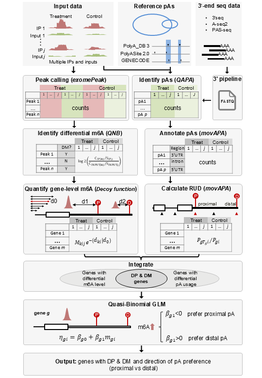

# m6APAffect
A QBGLM-based framework for identifying m6A-associated alternative polyadenylation genes and characterizing the direction of proximal–distal poly(A) site selection.

## About
m6APAffect is a QBGLM-based framework for identifying m6A-associated alternative polyadenylation (APA) genes from MeRIP-seq and 3'-end sequencing data.

The workflow integrates five analytical steps:

1. **Sequencing data preprocessing**

   Raw sequencing data are converted into FASTQ files, quality-controlled,
   adapter-trimmed, and aligned to the appropriate reference genome.

   For human data, the preprocessing workflow includes rRNA removal, genome
   alignment, BAM sorting and indexing, m6A peak analysis preparation, and
   QAPA-based APA quantification.

   For Arabidopsis data, the preprocessing workflow includes 3'-end read
   processing, STAR alignment, and generation of PAT, PA, and PAC files using
   PlantAPAdb.

2. **Differential m6A peak detection**

   m6A-enriched peaks are identified from MeRIP-seq immunoprecipitation and
   input libraries using `exomePeak`. Differential m6A signals are then
   evaluated using the methods implemented in `m6APAreg`.

3. **Poly(A) site identification and quantification**

   Poly(A) sites are obtained from MeRIP-seq input libraries using `QAPA` or
   from 3'-end sequencing data using an appropriate 3'-end sequencing
   pipeline.

   Poly(A) sites are annotated with `movAPA`, and proximal-distal poly(A) site
   pairs are constructed for genes with multiple 3'UTR poly(A) sites.
   Relative distal poly(A) site usage (RUD) is calculated to quantify APA
   selection.

4. **Integration of m6A and APA signals**

   m6A signals are normalized using matched input signals, weighted according
   to their distances from nearby poly(A) sites, and summarized into a
   distance-weighted gene-level m6A signal.

   Candidate genes are selected based on the presence of both differential
   m6A signals and differential proximal-distal APA usage.

5. **Gene-level association analysis**

   A quasi-binomial generalized linear model is fitted for each candidate
   gene, using the gene-level m6A signal as the explanatory variable and RUD
   as the response variable.

   The total read count of the proximal-distal poly(A) site pair is used as
   the observation weight, and empirical Bayes moderation is applied to
   improve dispersion estimation.

   Model-based P values and Benjamini-Hochberg-adjusted values are reported
   for statistical evaluation.

The regression coefficient indicates the direction of the m6A-associated APA
relationship:

- Positive coefficients indicate increased distal poly(A) site usage.
- Negative coefficients indicate increased proximal poly(A) site usage.

The resulting m6APAffect genes can be further analyzed using functional
enrichment, m6A-reader association, miRNA-binding site, cancer-related gene
set, and sequence motif analyses.


## Workflow



## Software and Dependencies
### R

- R 4.2.0
- movAPA 0.2.0
- limma 3.54.2
- clusterProfiler 3.10.1
- org.Hs.eg.db 3.16.0
- org.At.tair.db 3.22.0

### m6A and APA Analysis

- exomePeak 2.10.0
- QNB 1.0
- QAPA 1.3.0
- PlantAPAdb pipeline
- movAPA 0.2.0

### Sequencing Data Processing

- fastp 1.3.6
- HISAT2 2.2.0
- STAR 2.7.10a
- liftOver 1.36.0


## Data Preprocessing

The docs/ directory contains preprocessing scripts for the human and Arabidopsis thaliana example datasets. These scripts are independent of the m6APAreg R package and should be run before the downstream R workflows.

### Arabidopsis Data Preprocessing

The Arabidopsis preprocessing workflow processes A-seq and PAS-seq data, performs adapter trimming and read transformation when required, aligns reads with STAR, and generates PAC count matrices using PlantAPAdb.

Script: 
[`docs/run_Arabidopsis_3prime_seq_plantAPAdb.sh`](docs/run_Arabidopsis_3prime_seq_plantAPAdb.sh)

### Human Data Preprocessing

The main human preprocessing script is:

[`docs/run_human_m6A_APA_preprocessing.sh`](docs/run_human_m6A_APA_preprocessing.sh)

The corresponding configuration template is:

[`docs/config_hg38.sh`](docs/config_hg38.sh)


## Installation
### Install from GitHub

The `m6APAreg` R package is located in the `m6APAreg/` subdirectory of this repository. Install it from GitHub using:

```r
install.packages("remotes")

remotes::install_github(
  "BMILAB/m6APAffect",
  subdir = "m6APAreg",
  dependencies = TRUE
)

library(m6APAreg)
```
### Install from a downloaded ZIP archive

1. Download this repository as a ZIP file from **Code -> Download ZIP**.
2. Extract the ZIP archive.
3. Install the `m6APAreg` package from the `m6APAreg/` subdirectory:

```r
install.packages("remotes")

remotes::install_local(
  "path/to/m6APAffect-main/m6APAreg",
  dependencies = TRUE
)

library(m6APAreg)
```

Replace `"path/to/m6APAffect-main/m6APAreg"` with the actual path to the extracted `m6APAreg` directory on your computer.


## Examples
Two complete example scripts are provided:
- [`examples/Ara1_m6APAffect.R`](examples/Ara1_m6APAffect.R)
- [`examples/HeLa1_m6APAffect.R`](examples/HeLa1_m6APAffect.R)

The Arabidopsis example demonstrates the analysis of control m6A-seq data
without treated m6A-seq samples. In this setting, treated m6A values are
represented by zero placeholders to maintain the required model input
structure. These values are placeholders and do not represent experimentally
measured treated m6A signals.

The HeLa example analyzes control and knockdown m6A-seq data together with
QAPA-derived APA measurements.
